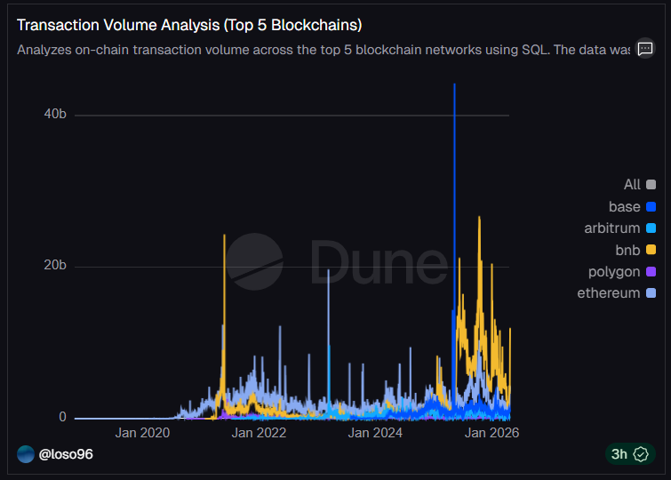
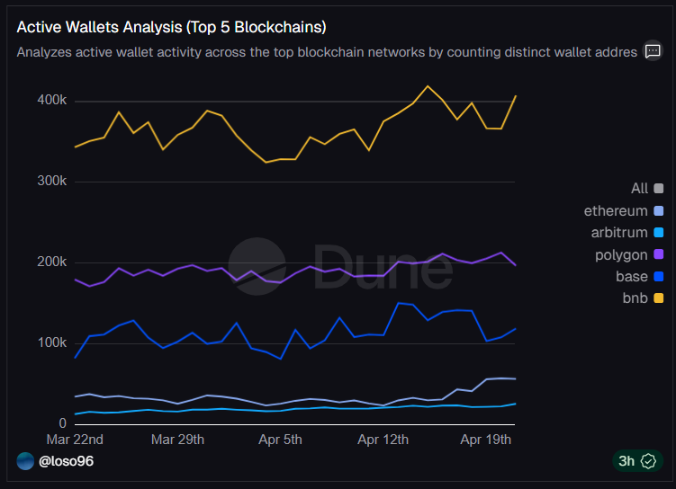

# Blockchain Activity Analysis

## 📊 Overview
This project analyzes on-chain activity across major blockchain networks using SQL in Dune Analytics. It focuses on transaction volume and active wallet activity to understand user behavior and network dynamics.

## 🎯 Objective
To evaluate trends in blockchain usage by comparing transaction volume and user engagement across the top-performing networks.

## 🧠 Methodology
- Queried curated blockchain datasets using SQL in Dune Analytics  
- Filtered data to the top 5 blockchains based on transaction volume to reduce noise  
- Analyzed two key metrics:
  - Transaction Volume (USD)
  - Active Wallets (distinct user addresses)  
- Built time-series visualizations to compare trends across networks  

## 📊 Key Insights
- BNB Chain shows the highest transaction volume among analyzed networks  
- Transaction volume does not always correlate with user activity  
- Some networks exhibit more stable user engagement over time

## 📸 Visualizations

## 💼 Business Interpretation
High transaction activity may be driven by fewer participants or high-frequency trading, while stable wallet growth suggests stronger user adoption. This highlights how different blockchain networks may serve different roles within the Web3 ecosystem.

## 📎 Project Link
👉 [Dune Dashboard](https://dune.com/loso96/blockchain-activity-dashboard)

## 🛠️ Tools Used
- SQL  
- Dune Analytics  
- Data Visualization  

## 🚀 Future Improvements
- Analyze specific protocols (e.g., Uniswap, Aave)  
- Compare growth rates across networks  
